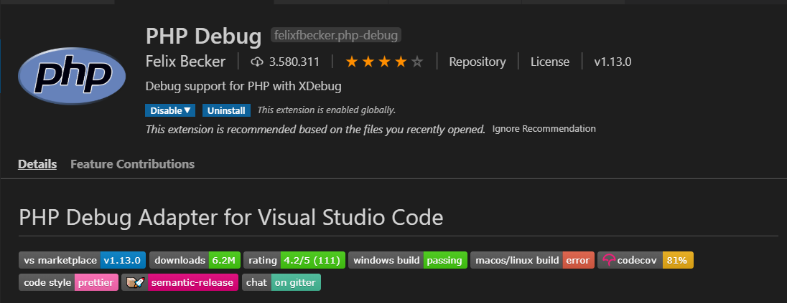
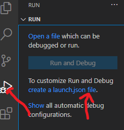
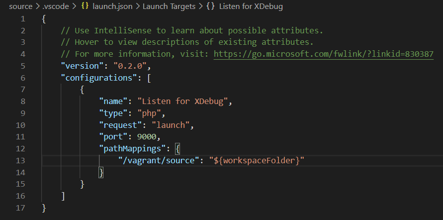

# Vagrant LAMP

Entorno Vagrant LAMP para Desarrollo basado en Ubuntu Server 20.04 con Apache 2.4.41, PHP 7.4, MariaDB 10.3.22, Composer, NPM y Git.

Es una construcción pensada para desarrollar y aprender a programar en PHP y que no contempla requerimientos de seguridad como firewall, contraseñas de BD, etc.
El script de provisionamiento se basa en muchos otros que ya existen en Internet, por lo que es mejorable. Para aprender a desarrollar en PHP durante la primera evaluación puede resultar válida.

## Requisitos

- VirtualBox  <http://www.virtualbox.org>
- Vagrant <http://www.vagrantup.com>
- Git <http://git-scm.com/>

## Qué está instalado

- Ubuntu Server 20.04 LTS (box generic/ubuntu2004)
- Apache 2.4 con mod rewrite enabled
- PHP 7.4
- MariaDB 10.3.22
- Git
- NPM
- Composer
- Locale 'es_ES.UTF-8 UTF-8'
- Teclado español

## Paquetes PHP incluidos

- php-pdo
- php-mysql
- php-mbstring
- php-bcmath
- php-xml
- php-intl
- php-common
- php-readline
- php-tokenizer
- php-gd
- php-imagick
- php-curl
- php-zip
- php-xdebug
- php-json
- php-opcache
- php-fpm

## Uso

```bash
mkdir dirtrabajo
cd dirtrabajo
git clone https://github.com/mlls2014/vagrant-lamp-t2.git .
vagrant up
```

Después de que la máquina virtual se instale y termine de provisionarse, puedes ir con tu navegador favorito a <http:\\192.168.250.254>.

Para acceder por _ssh_ utilizando _vagrant_ puedes teclear desde el directorio de trabajo

```bash
vagrant ssh
```

El acceso con otros clientes como _winscp_ o _putty_ es posible utilizando el _usuario_: *vagrant* _contraseña_: *vagrant*.

### Sobre la base de datos

Para asegurar la instalación de MariaDB podemos ejecutar, la primera vez que entremos en la máquina virtual, el siguiente comando

```bash
sudo mysql_secure_installation
```

De esta forma configuramos las claves necesarias para acceder a nuestra BD. En caso contrario el usuario _root_ no tendrá contraseña.

### Sobre la depuración de código PHP. Instalación de XDebug

El paquete _php-xdebug_ ya se encuentra instalado en nuestra máquina virtual y configurado para permitir la depuración en máquina remota (nuestro Windows anfitrión).

La configuración realizada sobre el Ubuntu Server ha sido:

Fichero **/etc/php/7.4/mods-available**

```bash
zend_extension=xdebug.so
xdebug.remote_enable=1
xdebug.remote_autostart = 1
xdebug.remote_connect_back = 1
xdebug.remote_port = 9000
xdebug.idekey = VSCODE
xdebug.max_nesting_level = 512
```

Fichero **/etc/php/7.4/apache2/php.ini**

Se agregan al final las siguientes líneas

```bash
[XDebug]
xdebug.remote_enable = 1
xdebug.remote_autostart = 1
```

Queda pendiente la configuración en el Entorno de Desarrollo Integrado (IDE) elegido para programar en PHP.

## Depurar código PHP en IDE Visual Code

- El primer paso sería instalar la extensión _PHP Debug_ de Felix Becker.



- Teniendo abierto el directorio raíz desde el que se va a ejecutar el código php que deseamos depurar (_Open Folder_) vamos a pinchar en el botón de depuración (símbolo play + bug). Creamos un fichero json de depuración (_create a launch.json file_). En este ejemplo tenemos abierto el directorio de trabajo del repositorio _dirtrabajo_.



- Seleccionamos el _Enviroment PHP_ y dejamos el fichero _launch.json_ de esta forma:



La directiva _pathMappings_ mapea los directorios del server al host.

La variable de entorno de VSCode _${workspaceFolder}_ representa el directorio de trabajo abierto en VSCode.

En este ejemplo indicamos que el proyecto a depurar se encuentra en el servidor en la ruta _/vagrant/source_, y en el host cliente en la ruta _${workspaceFolder}_. (El directorio abierto en VSCode es el _source_).

- A continuación ponemos los puntos de interrupción deseados en el código php, pinchamos en _Run - Start Debugging F5_ y abrimos la página php en el navegador. La depuración debería comenzar.

## Datos

- Dirección IP de la nueva máquina *192.168.250.254*
- Document root es */vagrant/source*
- Directorio compartido con Host OS es /vagrant
- mod rewritee enabled
- XDebug idekey = VCode
- Puerto remoto para XDebug es 9000

## Más datos

Añade la siguiente línea a tu archivo hosts:

```bash
192.168.250.254   somehost.dev
```

y podrás usar *somehost.dev* en tu navegador en vez de la IP.
